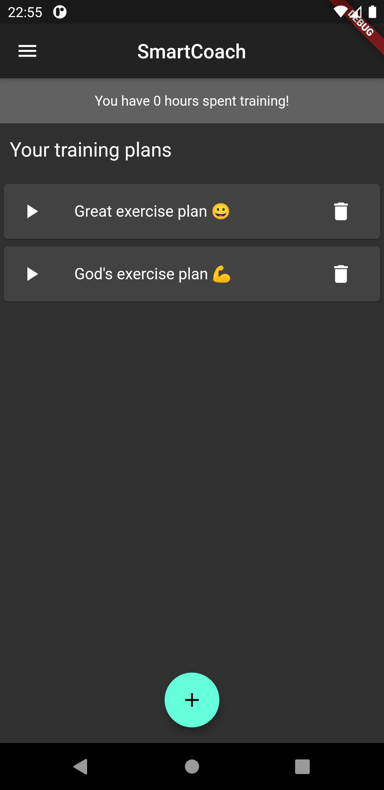
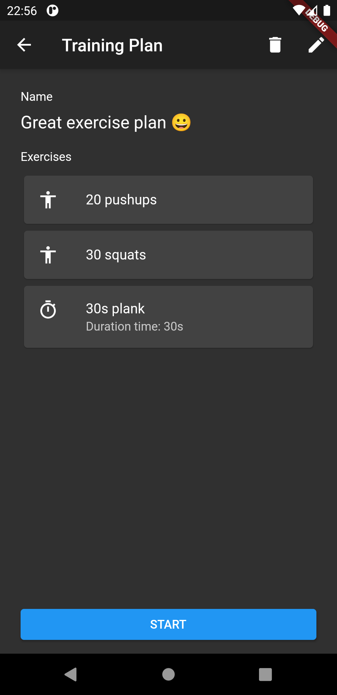
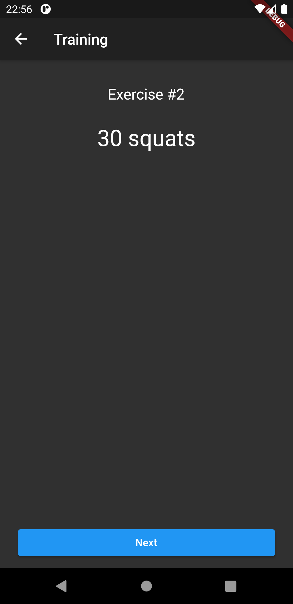
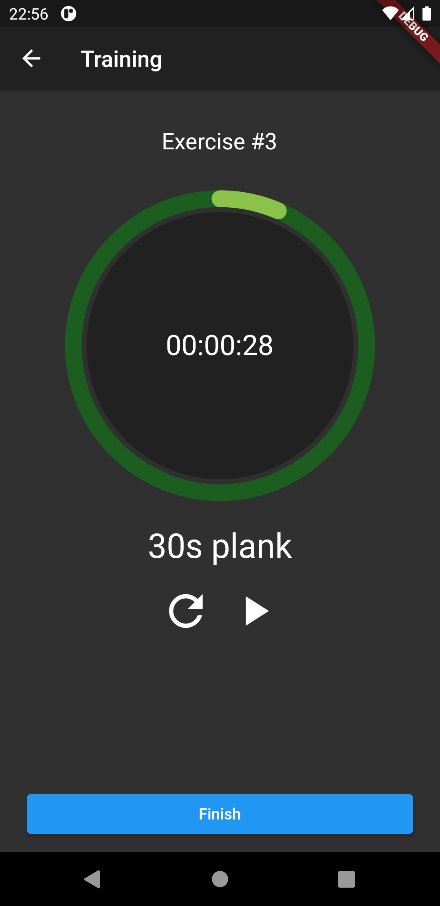
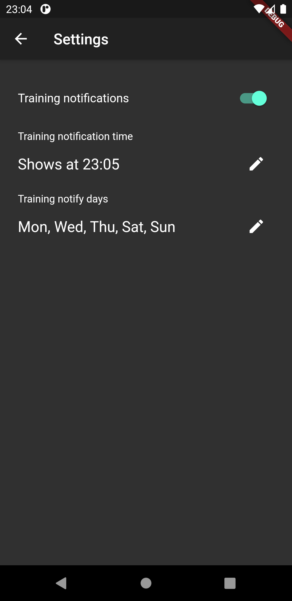
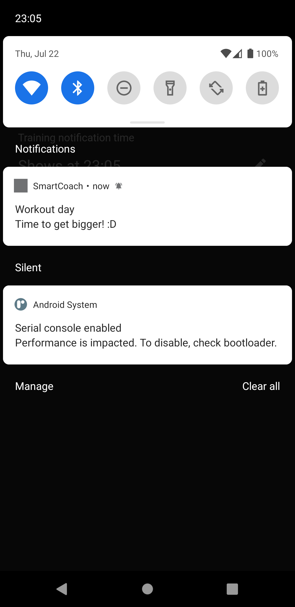

# SmartCoach

App made in Flutter that helps you plan your training routines. It notifies you in specified days to do workout. Made in around one week.

## Screenshots

  
  
  
  
  
  

## Problems

Notifications don't work on iOS unfortunately.

## License

License MIT
